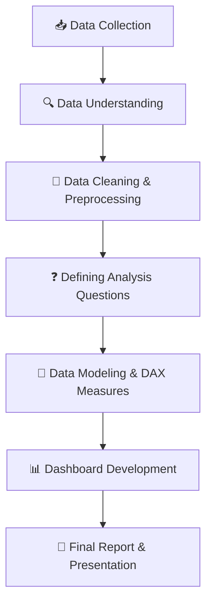

# 👥 Human Resources Dataset Analysis

### Power BI • Power Query • DAX

---

# 📌 Project Description

This project analyzes Human Resources (HR) data using **Power BI** to uncover insights that support better workforce decisions. It is part of the **Digital Egypt Pioneers Initiative (DEPI)** data analysis track.

The project focuses on analyzing:

- Employee satisfaction levels
- Employee attrition and retention
- Workforce demographics and trends
- Factors affecting employee performance and turnover

The project also includes data cleaning and preprocessing, DAX measures, and an interactive dashboard that answers key business questions for HR decision makers.

---

# 🎯 Project Objective

- Clean and prepare employee data for analysis
- Define the key analytical questions that matter to HR decision makers
- Answer these questions through an interactive Power BI dashboard
- Provide insights and recommendations to support data-driven decisions

### Example Analysis Questions
- What is the relationship between employee age and satisfaction level?
- Which departments and job roles have the highest attrition?
- Do salary or years of experience affect satisfaction and retention?

> ⏳ The final list of questions will be defined after reviewing the dataset.

---

# 📂 Project Resources

| Resource | Link |
| -------- | ---- |
| Project Files (Google Drive) | [To be added] |
| Dataset Source | [To be added] |

---

# 🛠️ Tools & Technologies

| Tool | Purpose |
| ---- | ------- |
| Power BI | Data cleaning, analysis, and dashboard development |
| Power Query | Data cleaning and transformation (ETL) |
| DAX | KPIs and calculated measures |
| PowerPoint | Final presentation and storytelling |

---

# ⚙️ Project Workflow

---

# 🧹 Data Cleaning & Preprocessing

> ⏳ This section will be completed once the dataset is received. It will include:
> - Dataset overview (number of rows and columns)
> - Challenges found during cleaning
> - Cleaning steps applied (missing values, duplicates, data types, formatting)

---

# 📄 Dashboard Pages

| Page | Description |
| ---- | ----------- |
| [To be added] | [To be added] |

---

# 📊 Key Insights

> ⏳ Key insights will be added after the analysis is completed.

---

# 📖 Presentation

The final report and presentation will summarize:

- Problem explanation and analysis questions
- Key insights
- Dashboard walkthrough
- Recommendations

---

# 👥 Team Members

| Name | Role |
| ---- | ---- |
| [Name] | [Role] |
| [Name] | [Role] |

---

# 👨‍🏫 Instructor

### [Instructor Name]

---

# ⏳ Project Timeline

| Phase | Duration | Status |
| ----- | -------- | ------ |
| 🧹 Data Cleaning & Preprocessing | Week 1 | ⬜ Not started |
| ❓ Analysis Questions | Week 2 | ⬜ Not started |
| 📊 Dashboard Development | Week 3 | ⬜ Not started |
| 📖 Final Report & Presentation | Week 4 | ⬜ Not started |

---

# ⭐ Project Status

## 🚧 In Progress
